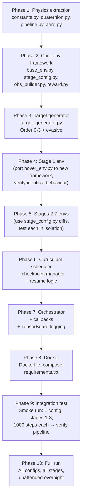

# Task D — Dockerized Multi-Stage RL Training Pipeline
## Implementation Plan v1.0

---

## 1. Codebase Audit Summary

### What exists today

| File | Role | Status |
|------|------|--------|
| [`hover_env.py`](file:///c:/Users/ADMIN/Desktop/projects/RL%20based%20autonomous%20interceptor%20drone/hover_env.py) | Gymnasium env, **Stage 1 only** (altitude hold). Scalar (N=1) physics, self-contained `_ph_*` functions, 14-dim obs, `AltitudeHoldRewardConfig` dataclass. | **Production-ready for Stage 1.** |
| [`swift_rl_env.py`](file:///c:/Users/ADMIN/Desktop/projects/RL%20based%20autonomous%20interceptor%20drone/swift_rl_env.py) | Vectorized physics pipeline (N-batch). `DroneEnvState`, `step()`, domain randomization, wind OU process. **Not a Gymnasium env** — raw step function with a placeholder reward. | **Physics core is solid.** Needs wrapping into Gymnasium for Stages 2–8. |
| [`swift_physics_headless_rlvec_latest.py`](file:///c:/Users/ADMIN/Desktop/projects/RL%20based%20autonomous%20interceptor%20drone/swift_physics_headless_rlvec_latest.py) | N=1 wrapper around `swift_rl_env` for comparison testing. Adds ground-effect fixes, body aero, motor reaction torque. | Thin shim — **not needed in training pipeline.** |
| [`SB3_AltitudeHold_Benchmark.ipynb`](file:///c:/Users/ADMIN/Desktop/projects/RL%20based%20autonomous%20interceptor%20drone/SB3_AltitudeHold_Benchmark.ipynb) | Colab notebook training PPO/A2C/SAC/TD3/DDPG on `AltitudeHoldEnv`. Has `RewardComponentCallback`, Monitor wrapping, checkpoint saving, evaluation rollout collection, matplotlib dashboard. | **Training patterns to extract.** Colab/Drive/plotting cruft to discard. |

### What does NOT exist yet

- **Stage 2–8 Gymnasium environments** (target generators, intercept reward, curriculum-specific obs)
- **Observation history stacking** (lookback window `m`, skip factor `s`)
- **Target trajectory generators** (constant-velocity through cubic kinematic)
- **Curriculum scheduler** (auto-advance, rollback, threshold logic)
- **Multi-config orchestrator** (run N named configs sequentially/parallel)
- **Crash/resume checkpointing** beyond SB3's built-in save/load
- **Docker infrastructure**

### Key architectural observations from the code

1. **Two physics backends coexist:**
   - `hover_env.py` uses scalar `_ph_*` functions (loops over 4 motors) — simple, correct, ~1 env
   - `swift_rl_env.py` uses vectorized batch functions — fast, supports N envs, but has only a placeholder reward and no Gymnasium wrapper
   
   **Decision needed:** The plan below uses `hover_env.py`'s scalar physics path wrapped in SB3's `DummyVecEnv`/`SubprocVecEnv` for multi-env parallelism (same as the working notebook). The vectorized `swift_rl_env.py` path is faster but would require a custom `VecEnv` subclass — that's an optimization for later, not the MVP.

2. **`hover_env.py` re-implements all physics inline** rather than importing from `swift_rl_env.py`. This means Stages 2–8 environments should follow the same pattern: self-contained physics, no cross-file state leakage.

3. **The existing Stage 1 observation (14-dim)** is altitude-hold-specific: `[6D_rot, v_WB, omega_B, delta_z, v_z]`. Stages 2+ need target-relative information instead of `delta_z/v_z`.

4. **The notebook's `RewardComponentCallback`** already logs decomposed reward terms to TensorBoard — this pattern must be preserved and extended.

---

## 2. Proposed Directory Layout

```
interceptor-training/
├── Dockerfile
├── docker-compose.yml
├── requirements.txt                 # Pinned: torch, sb3, gymnasium, numpy, tensorboard, pyyaml
├── configs/
│   └── default_run.yaml             # Multi-config run definition (see §4)
├── src/
│   ├── __init__.py
│   ├── physics/
│   │   ├── __init__.py
│   │   ├── constants.py             # All PH_* constants, extracted once
│   │   ├── quaternion.py            # _ph_quat2rot, _ph_quat_mult
│   │   ├── pipeline.py             # _ph_pid → _ph_rk4 (full physics pipeline)
│   │   └── aero.py                  # Aerodynamic model, ground effect, wind
│   ├── envs/
│   │   ├── __init__.py
│   │   ├── base_env.py             # BaseInterceptorEnv(gym.Env) — shared physics step,
│   │   │                           #   obs construction, history buffer, termination checks
│   │   ├── stage_config.py         # StageConfig dataclass + STAGE_REGISTRY dict
│   │   ├── reward.py               # RewardComputer class — stage-aware reward calculation
│   │   ├── target_generator.py     # TargetGenerator — kinematic parametric trajectories
│   │   └── obs_builder.py          # ObservationBuilder — 6D rot, body-frame target,
│   │                               #   history stacking (m, s), target_visible masking
│   ├── training/
│   │   ├── __init__.py
│   │   ├── curriculum.py           # CurriculumScheduler — rolling success, auto-advance,
│   │   │                           #   rollback, per-stage thresholds
│   │   ├── orchestrator.py         # RunOrchestrator — iterate configs × stages, sequential/parallel
│   │   ├── callbacks.py            # RewardComponentCallback, CurriculumAdvanceCallback,
│   │   │                           #   PeriodicSnapshotCallback
│   │   └── checkpoint_manager.py   # Save/load curriculum state, resume detection
│   └── utils/
│       ├── __init__.py
│       ├── logger.py               # Structured logging setup
│       └── config_loader.py        # YAML parsing, validation, defaults
├── scripts/
│   ├── train.py                    # Entrypoint: parse args, load config, run orchestrator
│   └── evaluate.py                 # Post-hoc evaluation: load model, run rollouts, save metrics
└── data/                           # Mounted volume target (inside container: /data)
    ├── checkpoints/                # Per-config, per-stage model saves
    ├── tb_logs/                    # TensorBoard event files
    ├── curriculum_state/           # JSON state files for crash/resume
    └── results/                    # Final models, evaluation rollouts
```

> [!IMPORTANT]
> The `data/` directory maps to a **host-mounted Docker volume** so everything persists across container restarts. The container itself is ephemeral.

---

## 3. Docker & Hardware Setup

### 3.1 RTX 5060 Ti (Blackwell / sm_120) Compatibility

The RTX 5060 Ti is Blackwell architecture, compute capability `sm_120`. This is a hard constraint:

| Component | Required Version | Why |
|-----------|-----------------|-----|
| **Host NVIDIA driver** | ≥ 550.54 (R550 branch) | sm_120 support. Run `nvidia-smi` to verify. |
| **CUDA toolkit** (in container) | ≥ 12.8 | sm_120 PTX/SASS compilation support. |
| **PyTorch** | ≥ 2.7.0 with CUDA 12.8 wheels | Pre-built sm_120 kernels ship starting 2.7. Older versions will silently fall back to CPU or crash. |
| **nvidia-container-toolkit** | Latest (≥ 1.16) | Passes GPU into Docker. |

> [!WARNING]
> **Do not use** `nvidia/cuda:12.x-runtime` images with CUDA < 12.8 — they will not contain sm_120 support and PyTorch operations will fail at runtime with `CUDA error: no kernel image is available for execution on the device`.

### 3.2 Dockerfile Design

```dockerfile
# --- Base image: PyTorch with CUDA 12.8 support ---
# Using the official PyTorch image guarantees pre-built sm_120 kernels
FROM pytorch/pytorch:2.7.0-cuda12.8-cudnn9-runtime

# System deps (minimal)
RUN apt-get update && apt-get install -y --no-install-recommends \
    git && \
    rm -rf /var/lib/apt/lists/*

WORKDIR /app

# Python dependencies
COPY requirements.txt .
RUN pip install --no-cache-dir -r requirements.txt

# Application code
COPY src/ src/
COPY scripts/ scripts/
COPY configs/ configs/

# Data volume mount point
VOLUME /data

# Entrypoint
ENTRYPOINT ["python", "scripts/train.py"]
CMD ["--config", "/data/configs/run.yaml"]
```

### 3.3 docker-compose.yml

```yaml
version: "3.8"
services:
  trainer:
    build: .
    runtime: nvidia              # requires nvidia-container-toolkit
    environment:
      - NVIDIA_VISIBLE_DEVICES=all
      - NVIDIA_DRIVER_CAPABILITIES=compute,utility
    volumes:
      - ./data:/data             # Persistent storage
      - ./configs:/data/configs  # Config files accessible inside container
    deploy:
      resources:
        reservations:
          devices:
            - driver: nvidia
              count: 1
              capabilities: [gpu]
    # Override CMD with specific config:
    # command: ["--config", "/data/configs/my_custom_run.yaml"]
```

### 3.4 requirements.txt (pinned)

```
torch>=2.7.0
stable-baselines3[extra]>=2.4.0
gymnasium>=1.0.0
numpy>=2.0.0
scipy>=1.13.0
tensorboard>=2.17.0
pyyaml>=6.0
```

> [!NOTE]
> `matplotlib` and `pygame` from the original `requirements.txt` are intentionally excluded — no rendering in the training container.

### 3.5 Host Setup Checklist (one-time)

```bash
# 1. Verify driver
nvidia-smi   # Should show driver ≥550, GPU = RTX 5060 Ti

# 2. Install nvidia-container-toolkit
curl -fsSL https://nvidia.github.io/libnvidia-container/gpgkey | \
  sudo gpg --dearmor -o /usr/share/keyrings/nvidia-container-toolkit-keyring.gpg
curl -s -L https://nvidia.github.io/libnvidia-container/stable/deb/nvidia-container-toolkit.list | \
  sed 's#deb https://#deb [signed-by=/usr/share/keyrings/nvidia-container-toolkit-keyring.gpg] https://#g' | \
  sudo tee /etc/apt/sources.list.d/nvidia-container-toolkit.list
sudo apt-get update && sudo apt-get install -y nvidia-container-toolkit
sudo nvidia-ctk runtime configure --runtime=docker
sudo systemctl restart docker

# 3. Quick GPU test
docker run --rm --gpus all pytorch/pytorch:2.7.0-cuda12.8-cudnn9-runtime \
  python -c "import torch; print(torch.cuda.get_device_name(0)); print(torch.cuda.get_device_capability(0))"
# Expected: "NVIDIA GeForce RTX 5060 Ti", (12, 0)
```

---

## 4. Configuration Schema

### 4.1 Run Configuration (`default_run.yaml`)

The config file defines one or more **named training configurations**, each fully specifying algorithm, architecture, hyperparameters, and observation settings. All configs in one file train sequentially within a single container run.

```yaml
# default_run.yaml — Multi-config unattended training run
# ========================================================

global:
  seed: 42
  device: "auto"                    # "cuda", "cpu", or "auto"
  data_dir: "/data"                 # Mount point inside container
  n_parallel_envs: 8               # SubprocVecEnv count
  checkpoint_interval_steps: 50000  # Periodic snapshots within each stage
  tensorboard: true
  execution_mode: "sequential"      # "sequential" | "parallel"
  # parallel mode: only if sum of VRAM < 16GB — see §4.3

# ── Curriculum stage definitions ──────────────────────────────────
# Shared across all configs. Per-stage overrides possible in config.
stages:
  stage_1:
    name: "Hover / Attitude Stabilization"
    target_type: "none"             # No target — hover task only
    target_visible: false
    world_bounds_radius: 15.0       # m (small arena for hover)
    max_episode_steps: 1000         # 10 seconds at 100Hz
    max_training_steps: 3_000_000   # Hard cap — stage CANNOT exceed this
    success_metric: "episode_reward_mean"
    success_threshold: 60.0         # ⚠️ NEEDS YOUR INPUT — see §10
    success_window: 100             # Rolling window of episodes
    success_rate: 0.85              # 85% of window must exceed threshold
    reward:
      k_alive: 0.10
      k_alt: 0.15
      k_tilt: 0.40
      k_angvel: 0.02
      omega_safe: 3.0
      k_thrust: 0.15
      k_smooth: 0.05
      k_crash: 200.0
      k_oob: 200.0
      # Stage 1 has NO target terms — these are absent, not zeroed
    obs:
      include_target: false         # Obs has no target-relative fields
      # Stage 1 uses the existing 14-dim obs from hover_env.py

  stage_2:
    name: "Directional Flight / Waypoint Tracking"
    target_type: "static_waypoint"  # Fixed waypoint, re-sampled per episode
    target_visible: true
    world_bounds_radius: 30.0
    max_episode_steps: 1500         # 15 seconds
    max_training_steps: 5_000_000
    success_metric: "mean_final_distance"
    success_threshold: 2.0          # ⚠️ metres — NEEDS YOUR INPUT
    success_window: 100
    success_rate: 0.80
    spawn:
      waypoint_distance_range: [8.0, 20.0]   # metres from origin
      waypoint_hemisphere: "forward"          # forward hemisphere bias
      cone_half_angle_deg: 60.0
    reward:
      # Inherits persistent terms from stage 1 (crash, oob, angvel, smooth)
      k_alive: 0.05                 # Reduced — less important than progress
      k_tilt: 0.20                  # Relaxed — drone needs to tilt to fly
      k_velocity_alignment: 0.30    # PRIMARY: v̂ · d̂ (velocity aligned with target direction)
      k_progress_delta: 0.15        # SECONDARY: Δdist (closer each step)
      k_angvel: 0.02
      k_smooth: 0.05
      k_crash: 200.0
      k_oob: 200.0
    obs:
      include_target: true

  stage_3:
    name: "Static Target Intercept (no time penalty)"
    target_type: "static"           # Fixed-position target
    target_visible: true
    world_bounds_radius: 40.0
    max_episode_steps: 2000         # 20 seconds
    max_training_steps: 5_000_000
    success_metric: "kill_rate"     # % episodes where miss_distance < kill_radius
    success_threshold: 0.70         # ⚠️ NEEDS YOUR INPUT
    success_window: 100
    success_rate: 0.70
    spawn:
      target_distance_range: [10.0, 30.0]
      target_hemisphere: "forward"
      cone_half_angle_deg: 45.0
      lateral_offset_max: 5.0       # metres
    intercept:
      kill_radius: 0.5              # ⚠️ metres — NEEDS YOUR INPUT
    reward:
      k_velocity_alignment: 0.30
      k_progress_delta: 0.15
      k_kill_bonus: 500.0           # ⚠️ NEEDS YOUR INPUT — terminal, scaled by miss distance
      k_miss_distance_scale: true   # Bonus = k_kill * max(0, 1 - miss/kill_radius)
      k_angvel: 0.02
      k_smooth: 0.05
      k_crash: 200.0
      k_oob: 200.0

  stage_4:
    name: "Static Target Intercept (with time penalty)"
    target_type: "static"
    target_visible: true
    world_bounds_radius: 40.0
    max_episode_steps: 2000
    max_training_steps: 5_000_000
    success_metric: "kill_rate"
    success_threshold: 0.75
    success_window: 100
    success_rate: 0.75
    spawn:
      target_distance_range: [10.0, 30.0]
      target_hemisphere: "forward"
      cone_half_angle_deg: 45.0
    intercept:
      kill_radius: 0.5
    reward:
      k_velocity_alignment: 0.30
      k_progress_delta: 0.15
      k_kill_bonus: 500.0
      k_time_penalty: 0.02          # NEW: per-step time pressure
      k_time_bonus_scale: true      # Kill bonus also scales with (1 - t/t_max)
      k_angvel: 0.02
      k_smooth: 0.05
      k_crash: 200.0
      k_oob: 200.0

  stage_5:
    name: "Order-1 Moving Target (constant velocity)"
    target_type: "order_1"          # x(t) = x0 + v0·t
    target_visible: true
    world_bounds_radius: 60.0       # Larger: (15+15)*2.0*1.25 ≈ 75 → 60 conservative
    max_episode_steps: 2500
    max_training_steps: 8_000_000
    success_metric: "kill_rate"
    success_threshold: 0.65
    success_window: 100
    success_rate: 0.65
    spawn:
      target_distance_range: [15.0, 40.0]
      target_speed_range: [2.0, 8.0]  # m/s — order-1
      target_hemisphere: "forward"
      cone_half_angle_deg: 45.0
      g_limit: 0.0                    # No acceleration for order-1
    reward:
      # Same structure as stage 4 — only env changes
      k_velocity_alignment: 0.30
      k_progress_delta: 0.15
      k_kill_bonus: 500.0
      k_time_penalty: 0.02
      k_time_bonus_scale: true
      k_angvel: 0.02
      k_smooth: 0.05
      k_crash: 200.0
      k_oob: 200.0

  stage_6:
    name: "Order-2 Moving Target (parabolic)"
    target_type: "order_2"          # x(t) = x0 + v0·t + 0.5·a·t²
    target_visible: true
    world_bounds_radius: 80.0
    max_episode_steps: 3000
    max_training_steps: 10_000_000
    success_metric: "kill_rate"
    success_threshold: 0.60
    success_window: 100
    success_rate: 0.60
    spawn:
      target_distance_range: [15.0, 50.0]
      target_speed_range: [2.0, 8.0]
      target_accel_g_limit: 2.0      # ⚠️ G — NEEDS YOUR INPUT
      target_hemisphere: "forward"
      cone_half_angle_deg: 45.0
    reward:
      k_velocity_alignment: 0.30
      k_progress_delta: 0.15         # May need distance normalization
      k_progress_normalize: true     # Normalize Δdist by current distance
      k_kill_bonus: 500.0
      k_time_penalty: 0.02
      k_time_bonus_scale: true
      k_angvel: 0.02
      k_smooth: 0.05
      k_crash: 200.0
      k_oob: 200.0

  stage_7:
    name: "Order-3 Moving Target (cubic)"
    target_type: "order_3"          # x(t) = x0 + v0·t + 0.5·a·t² + (1/6)·j·t³
    target_visible: true
    world_bounds_radius: 100.0
    max_episode_steps: 3000
    max_training_steps: 12_000_000
    success_metric: "kill_rate"
    success_threshold: 0.55
    success_window: 100
    success_rate: 0.55
    spawn:
      target_distance_range: [15.0, 60.0]
      target_speed_range: [2.0, 10.0]
      target_accel_g_limit: 2.0
      target_jerk_limit: 5.0         # ⚠️ m/s³ — NEEDS YOUR INPUT
      target_hemisphere: "forward"
      cone_half_angle_deg: 45.0
    reward:
      k_velocity_alignment: 0.30
      k_progress_delta: 0.15
      k_progress_normalize: true
      k_kill_bonus: 500.0
      k_time_penalty: 0.02
      k_time_bonus_scale: true
      k_angvel: 0.02
      k_smooth: 0.05
      k_crash: 200.0
      k_oob: 200.0

  stage_8:
    name: "Complex / Evasive Trajectories (stretch)"
    target_type: "evasive"
    target_visible: true
    world_bounds_radius: 120.0
    max_episode_steps: 3000
    max_training_steps: 15_000_000
    success_metric: "kill_rate"
    success_threshold: 0.50
    success_window: 100
    success_rate: 0.50
    spawn:
      target_distance_range: [20.0, 70.0]
      target_speed_range: [3.0, 12.0]
      target_accel_g_limit: 3.0
      target_jerk_limit: 8.0
      evasive_probability: 0.5       # 50% of episodes are evasive
    ablation:
      lookahead_enabled: [true, false]  # Branch: with/without lookahead
    reward:
      k_velocity_alignment: 0.30
      k_progress_delta: 0.15
      k_progress_normalize: true
      k_kill_bonus: 500.0
      k_time_penalty: 0.02
      k_time_bonus_scale: true
      k_angvel: 0.02
      k_smooth: 0.05
      k_crash: 200.0
      k_oob: 200.0

# ── Named training configurations ────────────────────────────────
# Each config trains the full curriculum (Stages 1→8) with its own
# algorithm + architecture + hyperparameters.

configs:
  ppo_baseline:
    algorithm: "PPO"
    stages: [1, 2, 3, 4, 5, 6, 7]   # Skip stage 8 (stretch goal)
    policy: "MlpPolicy"
    policy_kwargs:
      net_arch:
        pi: [256, 256, 128]          # Actor
        vf: [256, 256, 128]          # Critic
      activation_fn: "ReLU"
    obs_history:
      m: 3                           # Number of past observations
      s: 2                           # Skip factor (sample every 2nd past step)
    hyperparameters:
      n_steps: 4096
      batch_size: 512
      gamma: 0.995
      learning_rate: 3.0e-4
      gae_lambda: 0.95
      clip_range: 0.2
      ent_coef: 0.005
      n_epochs: 10
      max_grad_norm: 0.5
      vf_coef: 0.5

  sac_baseline:
    algorithm: "SAC"
    stages: [1, 2, 3, 4, 5, 6, 7]
    policy: "MlpPolicy"
    policy_kwargs:
      net_arch:
        pi: [256, 256]
        qf: [256, 256]
      activation_fn: "ReLU"
    obs_history:
      m: 3
      s: 2
    hyperparameters:
      learning_rate: 3.0e-4
      buffer_size: 1_000_000
      batch_size: 512
      gamma: 0.995
      tau: 0.005
      ent_coef: "auto"
      learning_starts: 25_000
      train_freq: 1

  td3_baseline:
    algorithm: "TD3"
    stages: [1, 2, 3, 4, 5, 6, 7]
    policy: "MlpPolicy"
    policy_kwargs:
      net_arch:
        pi: [256, 256]
        qf: [256, 256]
      activation_fn: "ReLU"
    obs_history:
      m: 3
      s: 2
    hyperparameters:
      learning_rate: 1.0e-3
      buffer_size: 1_000_000
      batch_size: 512
      gamma: 0.995
      tau: 0.005
      train_freq: 1
      learning_starts: 25_000
      action_noise_sigma: 0.1

  ppo_5layer_deep:
    algorithm: "PPO"
    stages: [1, 2, 3, 4, 5, 6, 7]
    policy: "MlpPolicy"
    policy_kwargs:
      net_arch:
        pi: [512, 256, 256, 128, 64]
        vf: [512, 256, 256, 128, 64]
      activation_fn: "ReLU"
    obs_history:
      m: 5                           # Wider lookback
      s: 3                           # Coarser skip
    hyperparameters:
      n_steps: 4096
      batch_size: 512
      gamma: 0.995
      learning_rate: 1.0e-4           # Lower LR for deeper net
      gae_lambda: 0.95
      clip_range: 0.15
      ent_coef: 0.01
      n_epochs: 15
      max_grad_norm: 0.5
```

### 4.2 Observation Space Dimensions

The obs size depends on `m` (history depth) and `s` (skip factor), plus the stage:

**Single-timestep observation vector (Stages 2+):**

| Component | Dims | Notes |
|-----------|------|-------|
| 6D rotation (first 2 cols of R_WB) | 6 | Continuous, no gimbal lock |
| World-frame velocity v_WB | 3 | Noisy |
| Body angular rate ω_B | 3 | Noisy |
| Target-relative position (body frame) | 3 | Zeroed if `target_visible=false` |
| Target-relative velocity (body frame) | 3 | Zeroed if `target_visible=false` |
| `target_visible` flag | 1 | 0.0 or 1.0 |
| **Single-frame total** | **19** | |

**With history stacking (m past frames, skip s):**
- Total observations per step = (m + 1) frames × 19 dims per frame
- Example: m=3, s=2 → frames at t, t-2, t-4, t-6 → 4 × 19 = **76 dims**

**Stage 1 special case:**
- Uses 14-dim obs (existing `hover_env.py` format): `[6D_rot, v_WB, omega_B, delta_z, v_z]`
- No history stacking in Stage 1 (or: m=0, s=any → just current frame)
- Target fields are absent (not zeroed — smaller obs)

> [!NOTE]
> When transitioning Stage 1 → Stage 2, the observation space **changes dimensions**. This means the policy network must be re-initialized for Stage 2 (the Stage 1 weights don't transfer to Stage 2's different input). This is acceptable because Stage 1 teaches attitude/stability — a different skill from intercept navigation. The Stage 1 trained model serves as proof-of-concept and for the PN comparison baseline, but Stage 2 starts fresh.
>
> **Alternative (your call):** Pad Stage 1's obs to 19-dim with zeroed target fields + `target_visible=0` so the same network architecture works across all stages. This enables weight transfer from Stage 1 → 2 but adds 5 "dead" input dims to Stage 1.

### 4.3 Parallel vs. Sequential Execution

**Default: Sequential** — configs train one at a time. Each config walks Stages 1→7 fully before the next config starts. Safe for 16GB VRAM.

**Optional: Parallel** — multiple configs co-reside on GPU. This only works if the combined model sizes + replay buffers fit in 16GB. Rules:

- PPO: ~50–200 MB VRAM depending on architecture + n_envs. Multiple PPO configs can co-reside.
- SAC/TD3: replay buffer lives on CPU but gradient computation uses GPU. ~100–300 MB each.
- **Conservative limit:** ≤ 3 configs simultaneously if all are MlpPolicy with < 5 layers.
- Implementation: Python `multiprocessing` with CUDA device sharing (PyTorch handles this natively).

The config has `execution_mode: "parallel"` but defaults to `"sequential"`.

---

## 5. Per-Stage Specification

This section specifies **exactly what changes** at each stage transition. The design philosophy: stages differ in their `StageConfig`, not in branching logic inside the env.

### 5.1 StageConfig Dataclass

```python
@dataclass
class StageConfig:
    stage_id: int
    name: str
    
    # --- Target ---
    target_type: str           # "none" | "static_waypoint" | "static" | "order_1" | "order_2" | "order_3" | "evasive"
    target_visible: bool
    
    # --- World ---
    world_bounds_radius: float
    max_episode_steps: int
    
    # --- Spawn ---
    spawn: SpawnConfig         # Distance/speed/accel ranges, hemisphere, cone angle
    
    # --- Intercept ---
    kill_radius: float
    
    # --- Reward ---
    reward: RewardConfig       # All k_* weights for this stage
    
    # --- Observation ---
    include_target_in_obs: bool
    
    # --- Curriculum ---
    max_training_steps: int
    success_metric: str
    success_threshold: float
    success_window: int
    success_rate: float
```

### 5.2 Stage-by-Stage Diff Table

| Aspect | Stage 1 | Stage 2 | Stage 3 | Stage 4 | Stage 5 | Stage 6 | Stage 7 | Stage 8 |
|--------|---------|---------|---------|---------|---------|---------|---------|---------|
| **Target type** | None | Static waypoint | Static target | Static target | Order-1 (const vel) | Order-2 (parabolic) | Order-3 (cubic) | Evasive |
| **target_visible** | `false` | `true` | `true` | `true` | `true` | `true` | `true` | `true` |
| **Obs includes target** | No (14-dim) | Yes (19-dim × frames) | Yes | Yes | Yes | Yes | Yes | Yes |
| **Obs history (m,s)** | 0,— | Config | Config | Config | Config | Config | Config | Config |
| **Reward: alive** | ✅ 0.10 | ✅ 0.05 | — | — | — | — | — | — |
| **Reward: altitude** | ✅ k_alt | — | — | — | — | — | — | — |
| **Reward: tilt** | ✅ 0.40 | ✅ 0.20 | — | — | — | — | — | — |
| **Reward: vel_align** | — | ✅ 0.30 | ✅ 0.30 | ✅ 0.30 | ✅ 0.30 | ✅ 0.30 | ✅ 0.30 | ✅ 0.30 |
| **Reward: progress_Δ** | — | ✅ 0.15 | ✅ 0.15 | ✅ 0.15 | ✅ 0.15 | ✅ 0.15 norm | ✅ 0.15 norm | ✅ 0.15 norm |
| **Reward: kill_bonus** | — | — | ✅ 500 | ✅ 500 + time | ✅ 500 + time | ✅ 500 + time | ✅ 500 + time | ✅ 500 + time |
| **Reward: time_penalty** | — | — | — | ✅ 0.02/step | ✅ 0.02/step | ✅ 0.02/step | ✅ 0.02/step | ✅ 0.02/step |
| **Persistent: crash** | ✅ 200 | ✅ 200 | ✅ 200 | ✅ 200 | ✅ 200 | ✅ 200 | ✅ 200 | ✅ 200 |
| **Persistent: oob** | ✅ 200 | ✅ 200 | ✅ 200 | ✅ 200 | ✅ 200 | ✅ 200 | ✅ 200 | ✅ 200 |
| **Persistent: angvel** | ✅ 0.02 | ✅ 0.02 | ✅ 0.02 | ✅ 0.02 | ✅ 0.02 | ✅ 0.02 | ✅ 0.02 | ✅ 0.02 |
| **Persistent: smooth** | ✅ 0.05 | ✅ 0.05 | ✅ 0.05 | ✅ 0.05 | ✅ 0.05 | ✅ 0.05 | ✅ 0.05 | ✅ 0.05 |
| **World radius** | 15 m | 30 m | 40 m | 40 m | 60 m | 80 m | 100 m | 120 m |
| **Episode length** | 1000 | 1500 | 2000 | 2000 | 2500 | 3000 | 3000 | 3000 |
| **Target speed** | — | — | — | — | 2–8 m/s | 2–8 m/s | 2–10 m/s | 3–12 m/s |
| **Target accel (G)** | — | — | — | — | 0 | ≤2G | ≤2G | ≤3G |
| **Target jerk** | — | — | — | — | 0 | 0 | ≤5 m/s³ | ≤8 m/s³ |

### 5.3 Target Trajectory Generator

```python
class TargetGenerator:
    """Kinematic parametric target trajectories.
    
    x(t) = x0 + v0·t + 0.5·a·t² + (1/6)·j·t³
    
    Parameters randomized per episode within G-limited bounds.
    Spawned on a sphere/forward hemisphere aimed roughly at the drone.
    """
    
    def __init__(self, stage_config: StageConfig, rng):
        self.cfg = stage_config
        self.rng = rng
    
    def sample_trajectory(self) -> TargetTrajectory:
        """Sample initial conditions for one episode."""
        # 1. Sample distance from spawn range
        # 2. Sample direction on hemisphere (cone_half_angle constraint)
        # 3. Add lateral offset
        # 4. Sample velocity/accel/jerk within per-stage bounds
        # 5. Return TargetTrajectory(x0, v0, a, j) — pure kinematic
        ...
    
    def evaluate(self, trajectory: TargetTrajectory, t: float) -> Tuple[np.ndarray, np.ndarray]:
        """Returns (position, velocity) at time t."""
        pos = trajectory.x0 + trajectory.v0 * t + 0.5 * trajectory.a * t**2 + (1/6) * trajectory.j * t**3
        vel = trajectory.v0 + trajectory.a * t + 0.5 * trajectory.j * t**2
        return pos, vel
```

### 5.4 Observation Builder

```python
class ObservationBuilder:
    """Constructs observation vectors with history stacking.
    
    Maintains a ring buffer of past observations.
    At each step: push current frame, return stacked [t, t-s, t-2s, ..., t-m*s].
    """
    
    def __init__(self, m: int, s: int, include_target: bool):
        self.m = m
        self.s = s
        self.include_target = include_target
        self.buffer_size = m * s + 1  # Need this many past frames
        self.buffer = deque(maxlen=self.buffer_size)
    
    def build_frame(self, drone_state, target_pos_body, target_vel_body, target_visible):
        """Build one observation frame (19-dim or 14-dim)."""
        R_WB = quat2rot(drone_state.q_WB)
        rot6d = R_WB[:, :2].ravel()  # 6D rotation
        
        frame = np.concatenate([
            rot6d + noise,                    # 6
            drone_state.v_WB + noise,         # 3
            drone_state.omega_B + noise,      # 3
            target_pos_body if include_target else [],  # 3 or 0
            target_vel_body if include_target else [],  # 3 or 0
            [float(target_visible)] if include_target else [],  # 1 or 0
        ])
        return frame
    
    def get_stacked_obs(self) -> np.ndarray:
        """Return [current, t-s, t-2s, ..., t-m*s] concatenated."""
        indices = [0] + [i * self.s for i in range(1, self.m + 1)]
        frames = []
        for idx in indices:
            if idx < len(self.buffer):
                frames.append(self.buffer[-(idx + 1)])
            else:
                frames.append(np.zeros_like(self.buffer[-1]))  # Zero-pad early steps
        return np.concatenate(frames).astype(np.float32)
```

### 5.5 Reward Computer

```python
class RewardComputer:
    """Stage-aware reward calculation.
    
    No branching logic — reward terms are selected by the presence/absence
    of k_* weights in the StageConfig.reward dict. Missing keys → term is 0.
    """
    
    def compute(self, drone_state, target_state, action, prev_action,
                prev_distance, step_count, stage_config) -> Tuple[float, bool, dict]:
        
        reward = 0.0
        info = {}
        terminated = False
        
        # ── Persistent terms (all stages) ──
        tilt = compute_tilt(drone_state.q_WB)
        angvel_norm = np.linalg.norm(drone_state.omega_B)
        act_delta = np.sum((action - prev_action) ** 2)
        
        r_angvel = -cfg.k_angvel * max(0, angvel_norm - cfg.omega_safe) ** 2
        r_smooth = -cfg.k_smooth * act_delta
        reward += r_angvel + r_smooth
        
        # ── Stage-specific terms (present only if key exists) ──
        if cfg.has('k_alive'):
            reward += cfg.k_alive
        
        if cfg.has('k_alt'):
            reward -= cfg.k_alt * abs(drone_state.p_WB[2] - target_alt)
        
        if cfg.has('k_velocity_alignment'):
            d_hat = normalize(target_pos - drone_state.p_WB)
            v_hat = normalize(drone_state.v_WB)
            reward += cfg.k_velocity_alignment * np.dot(v_hat, d_hat)
        
        if cfg.has('k_progress_delta'):
            delta = prev_distance - current_distance
            if cfg.get('k_progress_normalize', False):
                delta /= max(current_distance, 1.0)
            reward += cfg.k_progress_delta * delta
        
        if cfg.has('k_time_penalty'):
            reward -= cfg.k_time_penalty
        
        # ── Terminal terms ──
        if tilt > tilt_crash_threshold or crashed_ground:
            reward -= cfg.k_crash
            terminated = True
        
        if out_of_bounds(drone_state, stage_config):
            reward -= cfg.k_oob
            terminated = True
        
        if cfg.has('k_kill_bonus') and current_distance < cfg.kill_radius:
            bonus = cfg.k_kill_bonus
            if cfg.get('k_miss_distance_scale'):
                bonus *= max(0, 1 - current_distance / cfg.kill_radius)
            if cfg.get('k_time_bonus_scale'):
                bonus *= (1 - step_count / stage_config.max_episode_steps)
            reward += bonus
            terminated = True  # Successful intercept ends episode
        
        # ── Info dict (for TensorBoard) ──
        info = { 'r_angvel': r_angvel, 'r_smooth': r_smooth, ... }
        
        return reward, terminated, info
```

---

## 6. Curriculum Scheduler Design

### 6.1 Auto-Advance Logic

```python
class CurriculumScheduler:
    """Manages stage transitions based on rolling success metrics.
    
    Logic:
    1. Maintain a rolling window of episode outcomes (last N episodes)
    2. Compute success rate: fraction of episodes meeting the stage's threshold
    3. If success_rate >= required_rate for the current stage → advance
    4. If a later stage's metrics collapse → rollback option
    5. Hard cap: max_training_steps per stage prevents infinite loops
    """
    
    def __init__(self, stage_configs: List[StageConfig], checkpoint_manager):
        self.stages = stage_configs
        self.current_stage_idx = 0
        self.episode_buffer = deque(maxlen=200)  # Larger than any window
        self.ckpt = checkpoint_manager
    
    def on_episode_end(self, episode_result: dict) -> Optional[str]:
        """Called after each episode. Returns 'advance', 'rollback', or None."""
        self.episode_buffer.append(episode_result)
        cfg = self.current_stage
        
        # Check success criterion
        window = list(self.episode_buffer)[-cfg.success_window:]
        if len(window) < cfg.success_window:
            return None  # Not enough data yet
        
        success_count = sum(1 for ep in window 
                           if ep[cfg.success_metric] >= cfg.success_threshold)
        rate = success_count / len(window)
        
        if rate >= cfg.success_rate:
            self.ckpt.save_stage_transition(self.current_stage_idx)
            self.current_stage_idx += 1
            self.episode_buffer.clear()
            return 'advance'
        
        return None
    
    def check_hard_cap(self, total_steps_this_stage: int) -> bool:
        """Returns True if the stage's training budget is exhausted."""
        return total_steps_this_stage >= self.current_stage.max_training_steps
```

### 6.2 Rollback Strategy

If Stage N+1's rolling success rate drops below `rollback_threshold` (configurable, default: 50% of its `success_rate`), the scheduler:
1. Logs a warning
2. Reloads the Stage N→N+1 transition checkpoint
3. Re-enters Stage N for additional training (with a reduced `max_training_steps` budget)
4. Attempts Stage N+1 again

Maximum rollback attempts per stage: 2 (configurable). After that, the stage is marked as "stuck" and training proceeds to the next config.

---

## 7. Orchestrator — Multi-Config Sequential Run

```
Container starts
  └── scripts/train.py
       ├── Load config YAML
       ├── Check for resume state in /data/curriculum_state/
       │     └── If found: resume from last (config, stage, step)
       ├── For each config in configs (sequential):
       │     ├── Initialize CurriculumScheduler
       │     ├── For each stage in config.stages:
       │     │     ├── Build env (BaseInterceptorEnv + StageConfig)
       │     │     ├── Build/load SB3 model
       │     │     │     └── If stage > 1 and same obs space: load previous stage weights
       │     │     │     └── If obs space changed: fresh model
       │     │     ├── model.learn() with callbacks:
       │     │     │     ├── RewardComponentCallback → TB
       │     │     │     ├── CheckpointCallback → periodic saves
       │     │     │     ├── CurriculumAdvanceCallback → checks scheduler
       │     │     │     └── CurriculumStateCallback → saves resume state
       │     │     ├── On advance: save final stage model, clear replay buffer
       │     │     └── On hard cap: log warning, advance anyway
       │     └── Save final model for this config
       └── Log completion summary
```

### 7.1 Checkpoint/Resume State File

```json
// /data/curriculum_state/run_state.json
{
  "run_id": "20260925_105200",
  "config_file": "/data/configs/default_run.yaml",
  "configs_completed": ["ppo_baseline"],
  "current_config": "sac_baseline",
  "current_stage": 3,
  "current_stage_steps": 1_250_000,
  "total_steps_all_stages": 8_500_000,
  "last_checkpoint_path": "/data/checkpoints/sac_baseline/stage_3/sac_1250000_steps.zip",
  "episode_buffer": [...],   // Serialized deque for success-rate continuity
  "timestamp": "2026-09-25T12:34:56Z"
}
```

On container start, `train.py`:
1. Checks if `/data/curriculum_state/run_state.json` exists
2. If yes: validates config hash matches, loads state, resumes from `current_config + current_stage + last_checkpoint`
3. If no: starts fresh

### 7.2 Persistence Directory Structure

```
/data/
├── checkpoints/
│   ├── ppo_baseline/
│   │   ├── stage_1/
│   │   │   ├── ppo_50000_steps.zip      # Periodic snapshot
│   │   │   ├── ppo_100000_steps.zip
│   │   │   ├── ppo_stage_1_final.zip    # Stage completion model
│   │   │   └── monitor/                 # SB3 Monitor CSVs
│   │   ├── stage_2/
│   │   │   ├── ...
│   │   │   └── ppo_stage_2_final.zip
│   │   └── ...
│   ├── sac_baseline/
│   │   └── ...
│   └── td3_baseline/
│       └── ...
├── tb_logs/
│   ├── ppo_baseline/
│   │   ├── stage_1/                     # Per-stage TensorBoard dirs
│   │   ├── stage_2/
│   │   └── ...
│   ├── sac_baseline/
│   └── td3_baseline/
├── curriculum_state/
│   └── run_state.json
└── results/
    ├── ppo_baseline_final.zip
    ├── sac_baseline_final.zip
    └── run_summary.json
```

---

## 8. TensorBoard Logging

Extends the existing `RewardComponentCallback` pattern from the notebook. Each stage logs:

**Scalar metrics (per rollout/episode):**
- `reward_components/r_alive`, `r_tilt`, `r_angvel`, `r_smooth`, `r_velocity_alignment`, `r_progress_delta`, `r_kill_bonus`, `r_time_penalty` (only non-zero terms for current stage)
- `reward/episode_total`
- `metrics/alt_err`, `metrics/tilt`, `metrics/angvel_norm`, `metrics/miss_distance`, `metrics/time_to_intercept`
- `curriculum/current_stage`, `curriculum/success_rate`, `curriculum/episodes_in_window`

**Per-stage separation:**
Each stage writes to a distinct TensorBoard log directory (`tb_logs/<config>/<stage>/`) so you can overlay or isolate stages in the TensorBoard UI.

---

## 9. Algorithm Selection & Network Architecture

### 9.1 Algorithm Mapping

```python
ALGO_MAP = {
    "PPO":  stable_baselines3.PPO,
    "SAC":  stable_baselines3.SAC,
    "TD3":  stable_baselines3.TD3,
}
```

A2C and DDPG from the original notebook are dropped (your prompt specified PPO/SAC/TD3).

### 9.2 Network Architecture from Config

The `policy_kwargs` in the YAML config map directly to SB3's `policy_kwargs`:

```python
def build_policy_kwargs(cfg):
    activation_map = {"ReLU": nn.ReLU, "Tanh": nn.Tanh, "ELU": nn.ELU}
    return dict(
        net_arch=cfg.policy_kwargs.net_arch,  # e.g. {"pi": [256,256,128], "vf": [256,256,128]}
        activation_fn=activation_map[cfg.policy_kwargs.activation_fn],
    )
```

Input/output dimensions are **not configurable** — they're determined by the observation space (varies by `m`, `s`, and stage) and action space (always 4).

---

## 10. Success Criteria Proposals

> [!IMPORTANT]
> The following thresholds are **proposed starting points** based on the existing reward structure. All need your confirmation/tuning before implementation. Mark any you want changed.

| Stage | Metric | Threshold | Window | Rate | Max Steps | Rationale |
|-------|--------|-----------|--------|------|-----------|-----------|
| 1 | `episode_reward_mean` | ≥ 60.0 | 100 eps | 85% | 3M | A perfect 1000-step hover earns ~100 (k_alive=0.10×1000). 60 implies good hold with minor drift. |
| 2 | `mean_final_distance` | ≤ 2.0 m | 100 eps | 80% | 5M | Drone reaches within 2m of waypoint by episode end. |
| 3 | `kill_rate` | ≥ 70% | 100 eps | 70% | 5M | 70% of episodes achieve miss < kill_radius (0.5m). |
| 4 | `kill_rate` | ≥ 75% | 100 eps | 75% | 5M | Slightly higher bar: must intercept AND be time-efficient. |
| 5 | `kill_rate` | ≥ 65% | 100 eps | 65% | 8M | Moving target is harder — lower bar, more training budget. |
| 6 | `kill_rate` | ≥ 60% | 100 eps | 60% | 10M | Accelerating target — further relaxation. |
| 7 | `kill_rate` | ≥ 55% | 100 eps | 55% | 12M | Cubic target — hardest in core curriculum. |
| 8 | `kill_rate` | ≥ 50% | 100 eps | 50% | 15M | Stretch/evasive — lowest bar. |

**Hard cap behaviour:** If `max_training_steps` is hit before the success criterion is met, the stage is logged as "capped — did not converge", the current best model is saved, and training advances to the next stage anyway (to avoid blocking the entire run).

---

## 11. Open Decisions Requiring Your Input

> [!WARNING]
> The following items are flagged in the source project description as "not finalized" or "user should tune." **Implementation cannot proceed without your input on at least items 1–5.**

### 🔴 Must-decide before implementation

| # | Decision | Current Default / Proposal | Context |
|---|----------|---------------------------|---------|
| 1 | **Kill radius** | 0.5 m | What counts as a successful intercept? Crazyflie is ~10cm. A 0.5m radius is generous for a first pass. |
| 2 | **Kill bonus magnitude** | 500.0 | Should dominate cumulative dense reward (which is ~100–200 for a full episode). 500 gives ~3–5x dominance. |
| 3 | **Stage 1 success threshold** | `episode_reward_mean ≥ 60.0` | Depends on your training experience — have you seen typical episode rewards from the Colab runs? |
| 4 | **Observation space at Stage 1→2 transition** | Option A: 14-dim Stage 1, 19×(m+1)-dim Stage 2+ (fresh network). Option B: Pad Stage 1 to match Stage 2 dims (weight transfer). | See §4.2 note. Recommend Option A for simplicity. |
| 5 | **Sensor noise σ** | 0.01 (from existing `hover_env.py`) | Applied to all obs components equally. Is this reasonable for the target-relative terms too, or should target obs have different noise? |

### 🟡 Should-decide, have reasonable defaults

| # | Decision | Current Default | Notes |
|---|----------|----------------|-------|
| 6 | **Target G-limits per stage** | Stage 6: 2G, Stage 7: 2G, Stage 8: 3G | How aggressively should targets manoeuvre? |
| 7 | **Target jerk limits** | Stage 7: 5 m/s³, Stage 8: 8 m/s³ | |
| 8 | **Target speed ranges** | Stage 5: 2–8 m/s, 6: 2–8, 7: 2–10, 8: 3–12 | Crazyflie max speed ~15 m/s — target shouldn't be uncatchable. |
| 9 | **World bounds formula** | `radius ≥ (v_max_interceptor + v_max_target) × t_episode × 1.25` | The YAML defaults use fixed values. Should they be computed per-stage from speed/time? |
| 10 | **Reward weight normalization across stages** | Terminal terms (crash/oob=200, kill=500) constant; dense terms may sum differently. | Your spec says "reward magnitude should stay roughly consistent." Should we add a per-stage reward normalization factor? |
| 11 | **Rollback threshold** | 50% of the stage's `success_rate` | When should a stage trigger rollback? |
| 12 | **Max rollback attempts** | 2 per stage | |

### 🟢 Can proceed with defaults, tune later

| # | Decision | Default |
|---|----------|---------|
| 13 | `n_parallel_envs` | 8 (SubprocVecEnv) |
| 14 | PPO `n_steps` | 4096 |
| 15 | SAC/TD3 `buffer_size` | 1M |
| 16 | `gamma` (discount factor) | 0.995 (long episodes need high gamma) |
| 17 | `learning_rate` schedule | Constant (SB3 default). Linear decay available via `linear_schedule`. |
| 18 | Checkpoint interval | Every 50k steps |
| 19 | Domain randomization ranges | ±10–20% from `swift_rl_env.py` (already implemented) |
| 20 | Wind OU parameters | From `swift_rl_env.py` defaults (mean=1.5, θ=0.2–1.0, σ=0.3–2.0) |

---

## 12. Implementation Sequence

Once you approve the plan and provide inputs on the open decisions, implementation proceeds in this order:



**Estimated total implementation effort:** ~3000-4000 lines of Python + config, spread across ~15 files.

---

## 13. Risk Register

| Risk | Likelihood | Impact | Mitigation |
|------|-----------|--------|------------|
| PyTorch 2.7 + CUDA 12.8 image not yet on Docker Hub at run time | Medium | Blocks GPU training | Fall back to building from PyTorch nightly; or use `pip install torch --index-url https://download.pytorch.org/whl/cu128` in a base CUDA 12.8 image |
| Stage 1→2 obs space change breaks SB3 model loading | Certain (by design) | Policy resets | Document clearly; Option B (padded obs) is the alternative |
| SAC/TD3 replay buffer exceeds 32GB RAM with 1M entries | Low (each entry is ~76 floats → ~300 bytes → ~300 MB total) | OOM | Monitor; reduce `buffer_size` if needed |
| Curriculum never converges on a stage | Medium | Run hangs | Hard cap (`max_training_steps`) + fallback advance already designed |
| Container killed by host OOM killer during GPU training | Low | Lost progress | Resume from last checkpoint (§7.1) |

---

*Plan version: 1.0 — awaiting your review and input on §11 open decisions before implementation begins.*
